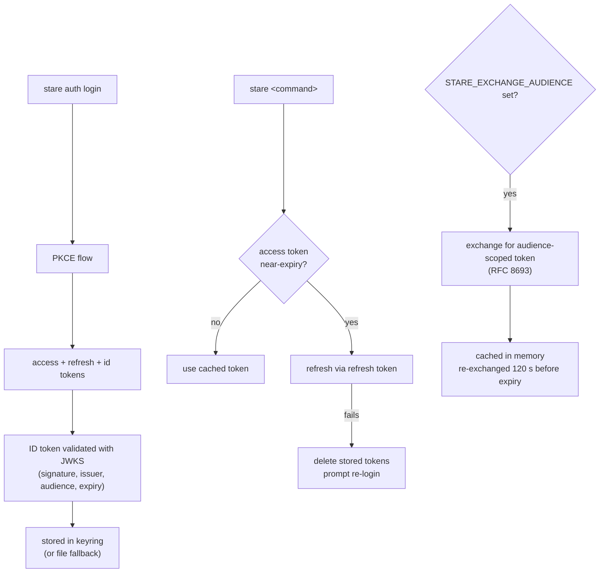

# Authentication

`stare` authenticates against CERN Keycloak using OAuth2 PKCE (Proof Key for
Code Exchange) — no passwords are ever stored, and tokens are kept in your
operating system's native credential store where available.

## Login and logout

```bash
stare auth login   # open CERN SSO in the browser, store tokens
stare auth status  # print whether a valid token is stored
stare auth logout  # revoke tokens server-side, then delete local storage
stare auth info    # display decoded JWT claims from the stored token
```

### `auth info` flags

| Flag             | Description                                                                       |
| ---------------- | --------------------------------------------------------------------------------- |
| `--access-token` | Print the raw PKCE access token                                                   |
| `--id-token`     | Print the raw PKCE id token                                                       |
| `--exchange`     | Show claims for the RFC 8693 exchanged token (requires `STARE_EXCHANGE_AUDIENCE`) |

`auth logout` sends a best-effort revocation request to the Keycloak `/revoke`
endpoint for both the access token and the refresh token before removing local
storage.

## Token storage

By default `stare` stores tokens in the operating system's native credential
store:

| Platform | Backend                                  |
| -------- | ---------------------------------------- |
| macOS    | Keychain                                 |
| Linux    | Secret Service (GNOME Keyring / KWallet) |
| Windows  | Credential Locker                        |

If no keyring backend is available (e.g. a headless CI machine), tokens fall
back to a JSON file:

| Platform | Path                                              |
| -------- | ------------------------------------------------- |
| Linux    | `~/.local/share/stare/tokens.json`                |
| macOS    | `~/Library/Application Support/stare/tokens.json` |
| Windows  | `%APPDATA%\stare\tokens.json`                     |

**Migration:** On first run after upgrading to a version with keyring support,
any existing plaintext token file is migrated to the keyring automatically and
the file is deleted.

## Token lifecycle



On login, `stare` validates the ID token using PyJWT against the CERN Keycloak
JWKS endpoint (`STARE_JWKS_URL`). Validation checks the signature, issuer, and
audience. If validation fails the tokens are **not** saved.

By default the access token is considered near-expiry when it has fewer than 60
seconds remaining (`STARE_TOKEN_EXPIRY_MARGIN_SECONDS`). Refresh tokens rotate
on use — if the Keycloak server rejects a refresh attempt (HTTP 4xx) the stored
token is deleted immediately and you are prompted to run `stare auth login`
again.

## Token exchange (RFC 8693)

Some Glance API endpoints require an audience-scoped token rather than the raw
PKCE access token. Set `STARE_EXCHANGE_AUDIENCE` to enable:

```bash
export STARE_EXCHANGE_AUDIENCE=atlas-analysis-api
stare analysis search --query '"referenceCode" = "ANA-HION-2018-01"'
```

The exchanged token is kept in memory only — never written to disk or keyring.
It is re-exchanged automatically when fewer than
`STARE_EXCHANGE_TOKEN_BUFFER_SECONDS` (default 120 s) remain before expiry.

## Concurrency safety

Multiple `stare` processes (or threads) running simultaneously are safe. A
`threading.Lock` guards in-process refresh races; a `filelock.FileLock` on the
token path guards cross-process races. If two processes race on a token refresh,
only one performs the refresh and both use the new token.

## Direct token injection

For CI pipelines where interactive browser login is not possible, inject a token
directly:

```python
import os
from stare import Glance

g = Glance(token=os.environ["GLANCE_TOKEN"])
```

When `token=` is provided, `TokenManager` is bypassed entirely — no token file
is read, written, or refreshed.

## Security properties

| Property                    | Verified | Notes                                                               |
| --------------------------- | -------- | ------------------------------------------------------------------- |
| ID token signature          | Yes      | RS256 via JWKS                                                      |
| ID token issuer             | Yes      | must match `STARE_ISSUER`                                           |
| ID token audience           | Yes      | must match `STARE_CLIENT_ID`                                        |
| ID token expiry             | Yes      | validated by PyJWT                                                  |
| Access token (display only) | No       | decoded for display, not verified                                   |
| Callback Host header        | Yes      | rejects requests from unexpected origins (DNS rebinding protection) |
| PKCE state parameter        | Yes      | CSRF protection                                                     |
| Refresh token rotation      | Handled  | stale token deleted on 4xx                                          |

The `auth info` command decodes the stored token for display purposes only,
without verifying the signature. Security decisions must not rely on `auth info`
output.
