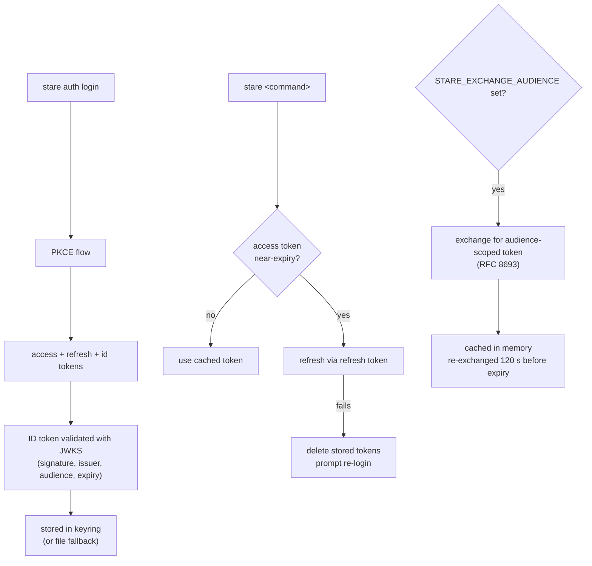

# Authentication

`stare` authenticates against CERN Keycloak using OAuth2 PKCE (Proof Key for
Code Exchange) — no passwords are ever stored, and tokens are kept in your
operating system's native credential store where available.

## Login and logout

```bash
stare auth login   # open CERN SSO in the browser, store tokens
stare auth status  # print whether a valid token is stored
stare auth logout  # revoke tokens server-side, then delete local storage
stare auth info    # display decoded JWT claims from the stored token
stare auth export  # print the offline refresh token (see Unattended use)
stare auth import  # store an offline session from a refresh token on stdin
```

Pass `--offline` to `stare auth login` to request an offline session for cron
jobs and CI — see [Unattended use](#unattended-use-cron-ci).

### `auth info` flags

| Flag             | Description                                                                       |
| ---------------- | --------------------------------------------------------------------------------- |
| `--access-token` | Print the raw PKCE access token                                                   |
| `--id-token`     | Print the raw PKCE id token                                                       |
| `--exchange`     | Show claims for the RFC 8693 exchanged token (requires `STARE_EXCHANGE_AUDIENCE`) |

`auth logout` sends a best-effort revocation request to the Keycloak `/revoke`
endpoint for both the access token and the refresh token before removing local
storage.

## Token storage

By default `stare` stores tokens in the operating system's native credential
store:

| Platform | Backend                                  |
| -------- | ---------------------------------------- |
| macOS    | Keychain                                 |
| Linux    | Secret Service (GNOME Keyring / KWallet) |
| Windows  | Credential Locker                        |

If no keyring backend is available (e.g. a headless CI machine), or a registered
backend is present but non-functional (e.g. a broken D-Bus Secret Service),
tokens fall back to a JSON file. Set `STARE_TOKEN_STORAGE=file` to always use
the file, or `STARE_TOKEN_STORAGE=keyring` to always use the keyring (backend
errors are then raised instead of falling back):

| Platform | Path                                              |
| -------- | ------------------------------------------------- |
| Linux    | `~/.local/share/stare/tokens.json`                |
| macOS    | `~/Library/Application Support/stare/tokens.json` |
| Windows  | `%APPDATA%\stare\tokens.json`                     |

**Migration:** On first run after upgrading to a version with keyring support,
any existing plaintext token file is migrated to the keyring automatically and
the file is deleted.

## Token lifecycle


```mermaid
flowchart TD
    A["stare auth login"] --> B["PKCE flow"]
    B --> C["access + refresh + id tokens"]
    C --> D["ID token validated with JWKS\n(signature, issuer, audience, expiry)"]
    D --> E["stored in keyring\n(or file fallback)"]

    F["stare &lt;command&gt;"] --> G{"access token\nnear-expiry?"}
    G -->|no| H["use cached token"]
    G -->|yes| I["refresh via refresh token"]
    I -->|fails| J["delete stored tokens\nprompt re-login"]

    K{"STARE_EXCHANGE_AUDIENCE set?"} -->|yes| L["exchange for audience-scoped token\n(RFC 8693)"]
    L --> M["cached in memory\nre-exchanged 120 s before expiry"]
```

On login, `stare` validates the ID token using PyJWT against the CERN Keycloak
JWKS endpoint (`STARE_JWKS_URL`). Validation checks the signature, issuer, and
audience. If validation fails the tokens are **not** saved.

By default the access token is considered near-expiry when it has fewer than 60
seconds remaining (`STARE_TOKEN_EXPIRY_MARGIN_SECONDS`). Refresh tokens rotate
on use — if the Keycloak server rejects a refresh attempt (HTTP 4xx) the stored
token is deleted immediately and you are prompted to run `stare auth login`
again.

## Unattended use (cron / CI)

A normal `stare auth login` session is tied to your CERN SSO session: once that
ends, the refresh token is rejected and stare asks you to log in again. For
scheduled jobs, request an **offline session** instead. Its refresh token
survives SSO logout and browser restarts.

### 1. Log in with an offline session

```bash
stare auth login --offline
stare auth info   # Session: offline — no fixed expiry; lapses if unused …
```

Offline sessions have no fixed expiry. They lapse only if unused for longer than
the offline-session idle timeout configured on CERN Keycloak (not visible to the
client), and every run renews them — so a job that runs regularly keeps working
indefinitely.

!!! warning "An offline session outlives your SSO logout"

    Treat the stored token like a password. End the session with
    `stare auth logout` on the host that holds it, which revokes it server-side.
    `--offline` is deliberately not the default.

### 2. Store it where the job can read it

On macOS, cron jobs usually cannot unlock the login Keychain. Keep the session
in the token file instead, and set the same variable in the job:

```bash
stare auth export --move | STARE_TOKEN_STORAGE=file stare auth import
```

```cron
0 6 * * * STARE_TOKEN_STORAGE=file stare analysis search -q 'status = Active' > active.json
```

On a headless Linux host without a keyring the file is used automatically.

### 3. Move the session to another host

Log in on your laptop, then transfer the session:

```bash
stare auth export --move | ssh cronhost 'STARE_TOKEN_STORAGE=file stare auth import'
```

`stare auth export` prints only the offline **refresh token** on stdout (the
warning goes to stderr, so it pipes cleanly). It refuses online sessions, which
would die with your SSO session. This is different from
`stare auth info --access-token`, which prints a short-lived access token
(minutes) that cannot be renewed.

`stare auth import` reads the token from stdin — or prompts with hidden input
when run in a terminal, for pasting — and redeems it immediately, so a bad or
expired token fails at import time rather than on the first scheduled run. A
rejected import leaves any session already on that host untouched.

!!! note "One session, one host"

    Keycloak rotates refresh tokens on every use. Once the new host refreshes,
    the copy left behind may be rejected on its next refresh. `--move` deletes
    the local copy (without revoking it) so the session lives in exactly one
    place. Run `stare auth login --offline` again on any host that needs its
    own session.

The same operations are available from Python via
[`TokenManager`][stare.auth.TokenManager]: `login(offline=True)`,
`get_session_info()`, `export_refresh_token(move=...)`, and
`import_refresh_token(token)`.

## Token exchange (RFC 8693)

Some Glance API endpoints require an audience-scoped token rather than the raw
PKCE access token. Set `STARE_EXCHANGE_AUDIENCE` to enable:

```bash
export STARE_EXCHANGE_AUDIENCE=atlas-analysis-api
stare analysis search --query 'referenceCode = ANA-HION-2018-01'
```

The exchanged token is kept in memory only — never written to disk or keyring.
It is re-exchanged automatically when fewer than
`STARE_EXCHANGE_TOKEN_BUFFER_SECONDS` (default 120 s) remain before expiry.

## Concurrency safety

Multiple `stare` processes (or threads) running simultaneously are safe. A
`threading.Lock` guards in-process refresh races; a `filelock.FileLock` on the
token path guards cross-process races. If two processes race on a token refresh,
only one performs the refresh and both use the new token.

## Direct token injection

For short-lived scripts that already have an access token, inject it directly.
Access tokens expire within minutes and are never refreshed on this path, so for
cron jobs and recurring CI use an [offline session](#unattended-use-cron-ci)
instead.

```python
import os
from stare import Glance

g = Glance(token=os.environ["GLANCE_TOKEN"])
```

When `token=` is provided, `TokenManager` is bypassed entirely — no token file
is read, written, or refreshed.

## Security properties

| Property                    | Verified | Notes                                                               |
| --------------------------- | -------- | ------------------------------------------------------------------- |
| ID token signature          | Yes      | RS256 via JWKS                                                      |
| ID token issuer             | Yes      | must match `STARE_ISSUER`                                           |
| ID token audience           | Yes      | must match `STARE_CLIENT_ID`                                        |
| ID token expiry             | Yes      | validated by PyJWT                                                  |
| Access token (display only) | No       | decoded for display, not verified                                   |
| Callback Host header        | Yes      | rejects requests from unexpected origins (DNS rebinding protection) |
| PKCE state parameter        | Yes      | CSRF protection                                                     |
| Refresh token rotation      | Handled  | stale token deleted on 4xx                                          |

The `auth info` command decodes the stored token for display purposes only,
without verifying the signature. Security decisions must not rely on `auth info`
output.
