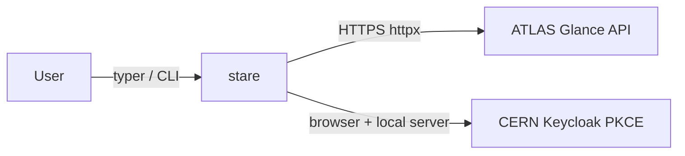

# Contributing

## Architecture



The library uses **httpx** for HTTP, **pydantic** for all data models, implements
OAuth2 PKCE natively, and **typer + rich** for the CLI.

## Development setup

```bash
git clone https://github.com/kratsg/stare
cd stare
pixi install
pixi run pre-commit-install
pixi run stare auth login
```

## Build and test commands

```bash
pixi run test          # quick tests (no live CERN needed)
pixi run test-slow     # all tests including live integration (requires stare login)
pixi run lint          # pre-commit + pylint
pixi run build         # build sdist + wheel
pixi run build-check   # verify the built distributions with twine
pixi run docs-serve    # build and serve docs locally
```

## Adding a new endpoint

When the Glance/Fence API adds a new endpoint:

1. Add or update the pydantic model in `src/stare/models/`
2. Write a failing test in `tests/test_models.py` (TDD)
3. Make the test pass
4. Add a resource accessor method in `src/stare/client.py`
5. Write a failing test in `tests/test_client.py`
6. Make it pass
7. Add a CLI command in `src/stare/cli.py`
8. Write a failing test in `tests/test_cli.py`
9. Make it pass
10. Run `pixi run test` to confirm everything is green

## Model conventions

All pydantic models use:

- `model_config = ConfigDict(populate_by_name=True)` — allows access by both
  alias and Python attribute name
- `Field(alias="camelCaseKey")` — maps API JSON keys to Python snake_case names
- `None` defaults for all optional fields

Example:

```python
from pydantic import BaseModel, ConfigDict, Field


class MyModel(BaseModel):
    model_config = ConfigDict(populate_by_name=True)

    reference_code: str = Field(alias="referenceCode")
    short_title: str | None = Field(default=None, alias="shortTitle")
```

## Regenerating the client scaffolding

When the OpenAPI spec at
`https://atlas-glance.cern.ch/atlas/analysis/api/docs/api.yml` is updated,
regenerate the reference scaffolding and translate the relevant parts into
`src/stare/`.

```bash
uvx openapi-python-client generate \
    --url https://atlas-glance.cern.ch/atlas/analysis/api/docs/api.yml \
    --output-path _generated --overwrite
# _generated/ is gitignored — reference only, never shipped
```

Translate generated `attrs`-based models into pydantic `BaseModel` subclasses,
map verbose generated names (`SearchAnalysisResponseResultsItemPhase0`) to short
domain names (`Phase0`), and add `Field(alias=...)` for camelCase keys.

## Tests

Tests live in `tests/`. The test layout mirrors the source:

| File                             | Tests                                                              |
| -------------------------------- | ------------------------------------------------------------------ |
| `tests/test_settings.py`         | `StareSettings` env-var overrides                                  |
| `tests/test_exceptions.py`       | Exception hierarchy and `ApiError` fields                          |
| `tests/test_models.py`           | Pydantic model parsing from fixture JSON                           |
| `tests/test_auth.py`             | `TokenManager` login/logout/refresh                                |
| `tests/test_client.py`           | `Glance` client + resource accessors (respx mocks)                 |
| `tests/test_cli.py`              | typer CLI via `CliRunner`                                          |
| `tests/integration/test_live.py` | Live CERN endpoints (requires `stare login`, run with `--runslow`) |

Key fixtures in `tests/conftest.py`:

- `test_settings` — `StareSettings` pointing at a localhost mock URL
- `stored_token_path` — temp file with a pre-written valid token
- `tmp_token_path` — temp file path (does not exist yet)
